# Тестування працездатності системи

# Початкові дані
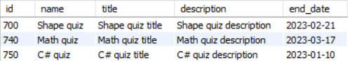
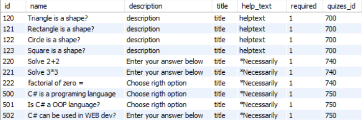

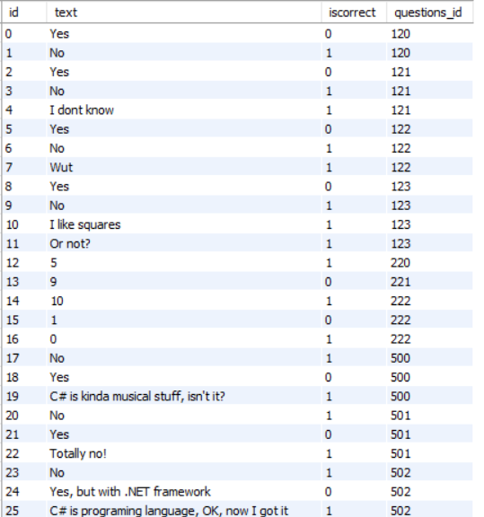

# Запити до таблиці options
## GET запит
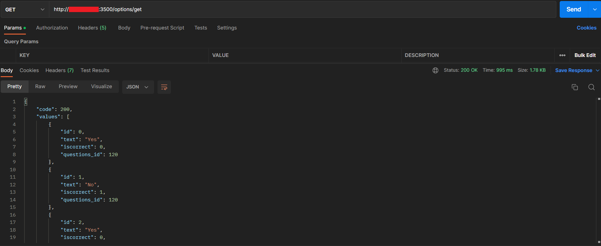
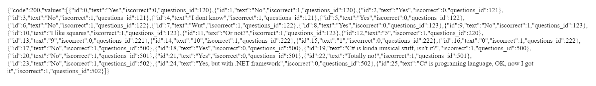
## GET запит по id
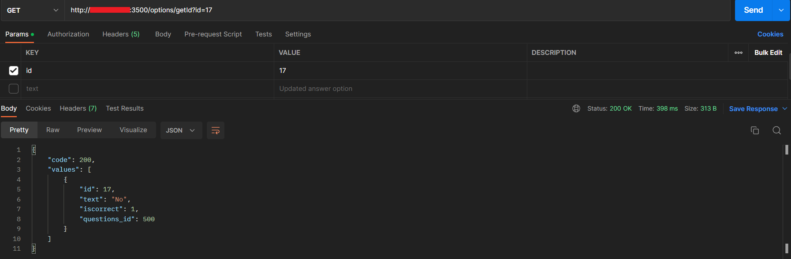
## GET запит по questions_id
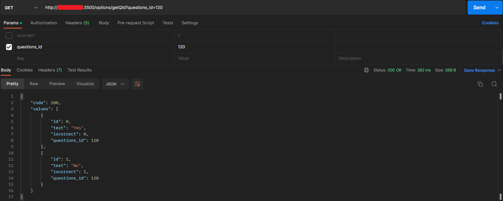
## POST запит
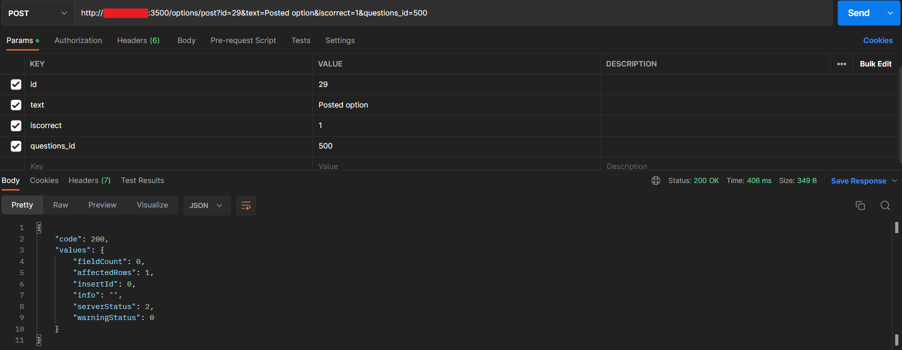
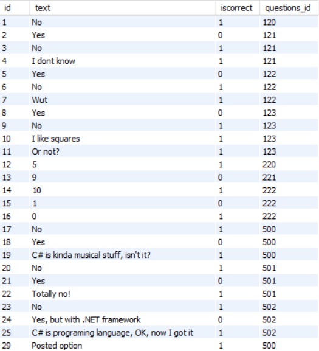
## PUT запит

## DELETE запит
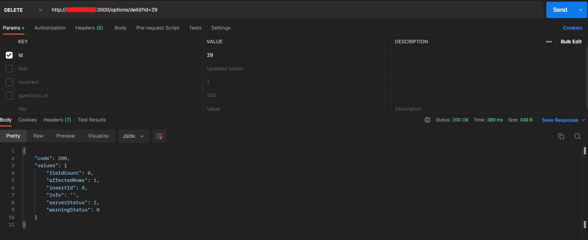
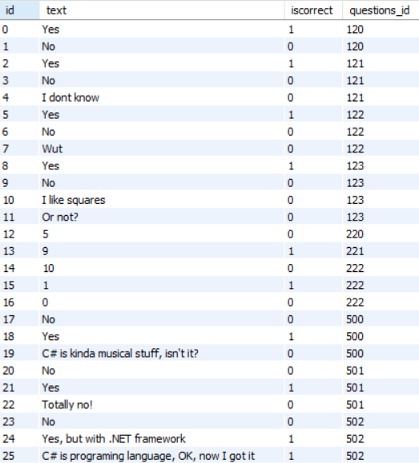
## DELETE запит по questions_id
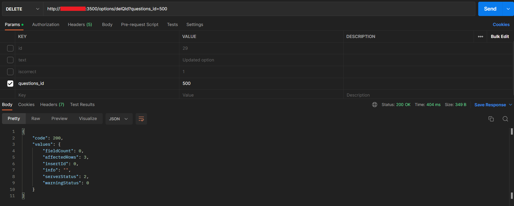
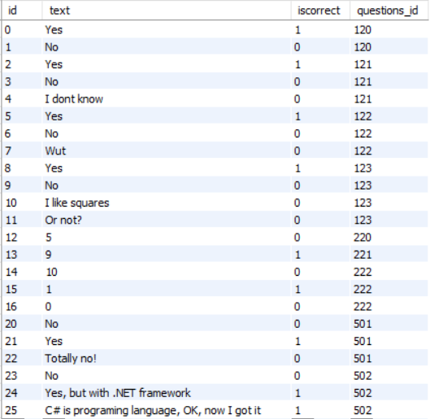
# Результати при виконанні з неправильними або недостатними даними
## GET запит по неіснуючому id
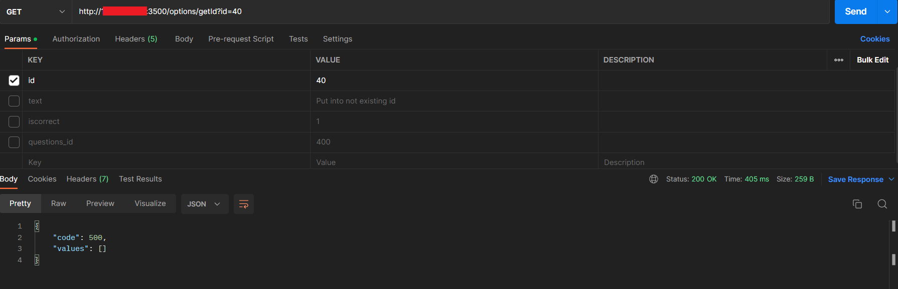
## GET запит по неіснуючому questions_id
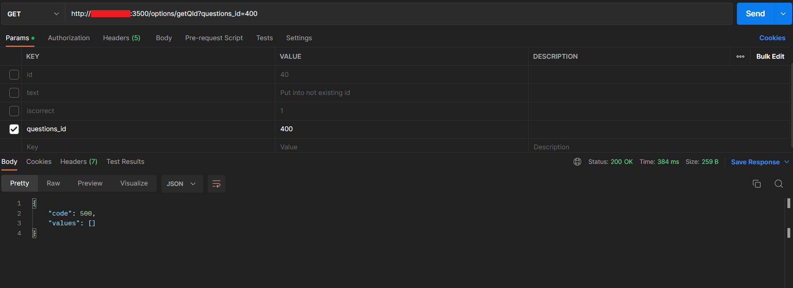
## PUT запит по неіснуючому id
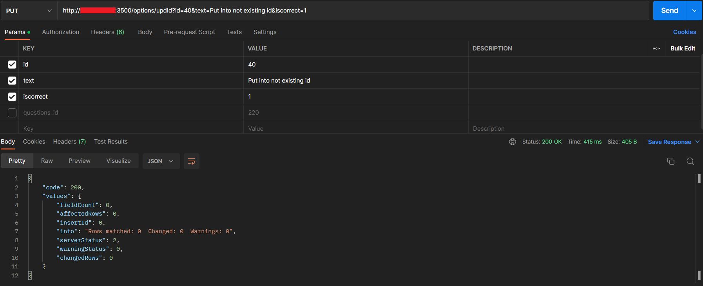
## POST запит у вже існуючий id
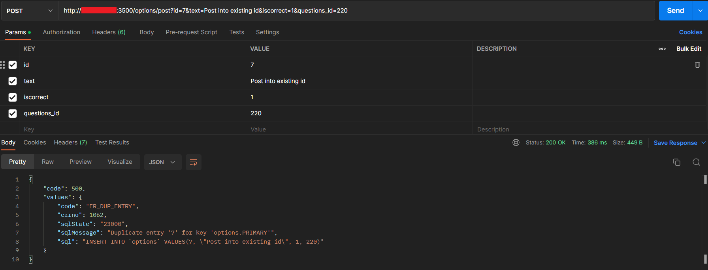
## DELETE запит по неіснуючому id
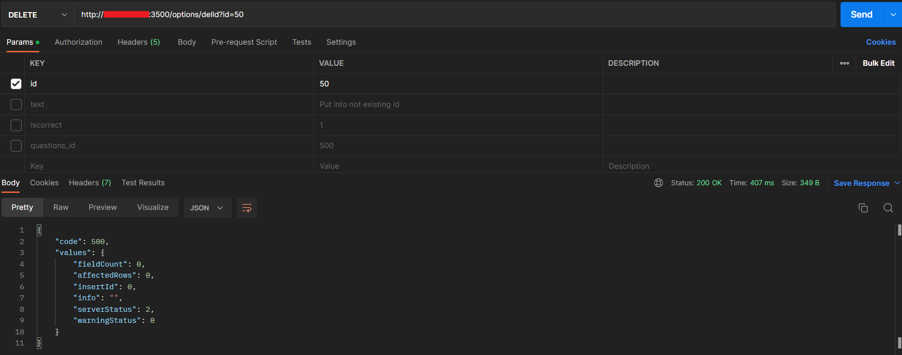
## DELETE запит по неіснуючому questions_id
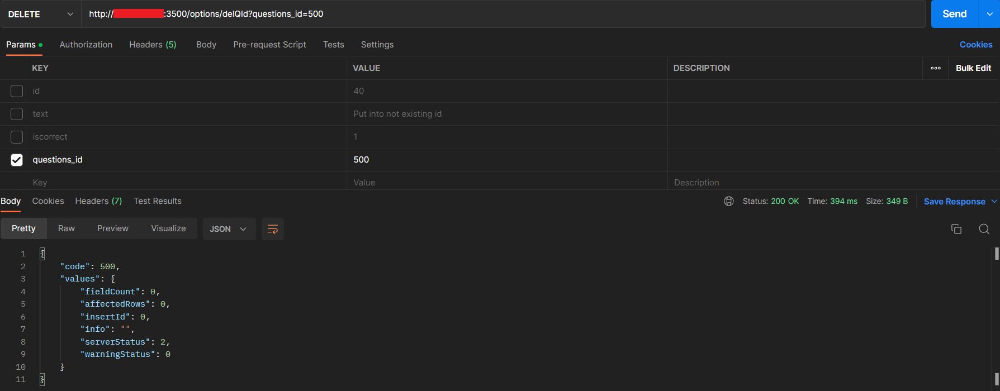
## POST запит з неповними даними
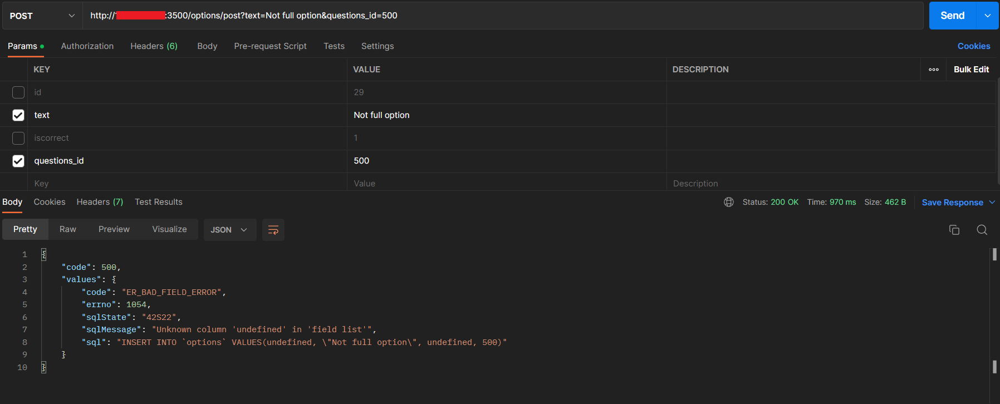
## DELETE запит (по id) з неповними даними
 з неповними даними")
## DELETE запит (по questions_id) з неповними даними
 з неповними даними")
## PUT запит з неповними даними
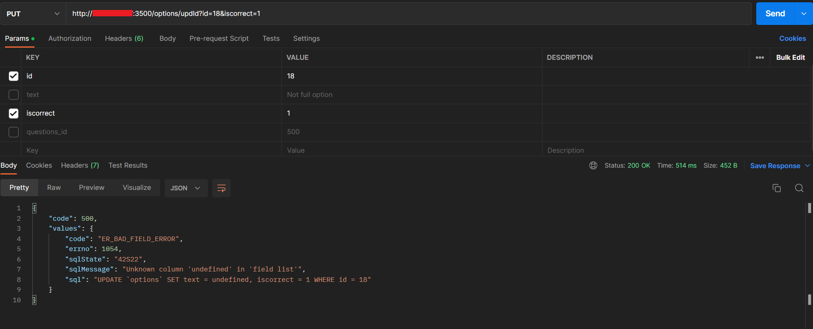